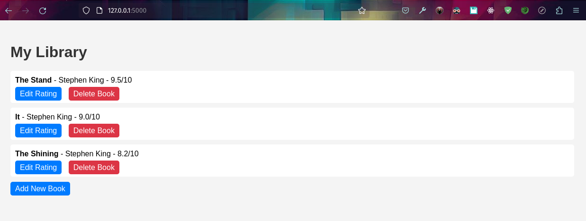

# Book Library Flask App

A simple Flask web application to manage a collection of books. 

## Features

- View a list of all books in the library.
- Add new books with title, author, and rating.
- Edit the rating of a book.
- Delete a book from the collection.

## Setup

1. Clone this repository:
    ```bash
    git clone https://github.com/j-breedlove/library_simulator_flask.git
    cd library_simulator_flask
    ```
2. Setup a pipenv environment and install required packages:
    ```bash
    pip install pipenv
    pipenv install Flask Flask-SQLAlchemy
    pipenv shell
    ```
3. Run the app:
    ```bash
    python app.py
    ```
4. Visit `http://127.0.0.1:5000/` in your browser.

## Database

The app uses SQLite for its database, managed using Flask-SQLAlchemy.

## Author

Jason Breedlove

## License

This project is open source and available under the [MIT License](LICENSE).
